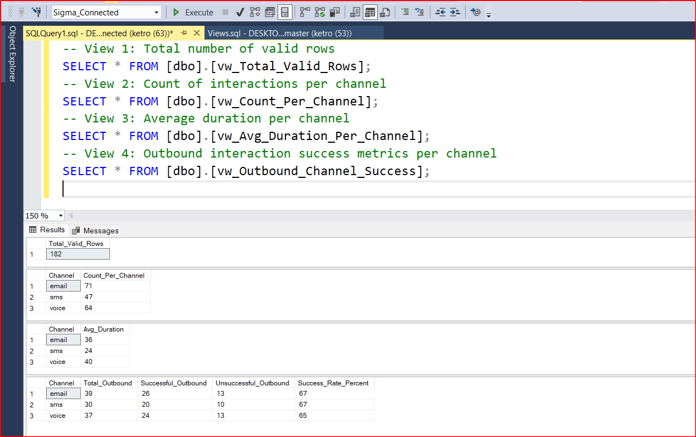
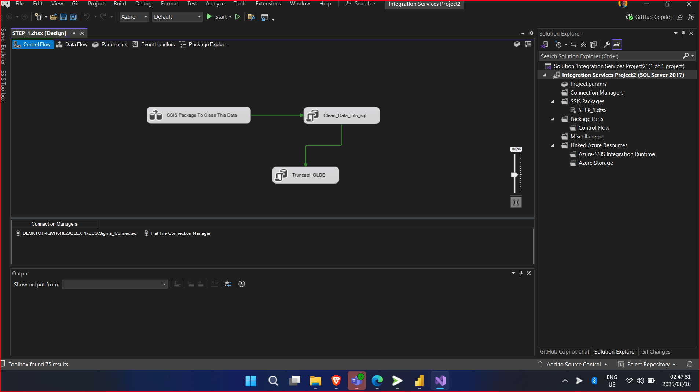

# 📊 Customer Interaction Analytics – KETRO FINAL

This project presents a fully developed data pipeline and analysis solution for customer communication interactions across **email**, **SMS**, and **voice** channels. It includes robust preprocessing, insight generation, visualization, and ETL pipeline automation using **SSIS** and **Power BI**.

---

## 🧹 Data Cleaning & Processing (Python)

The Python script `01_data_cleaning.py` performs the following:

- **Standardizes** timestamps to ISO format (`YYYY-MM-DD HH:MM:SS`)
- Converts `Channel` and `Status` fields to **lowercase**
- Drops rows with missing or invalid `CustomerID` and malformed timestamps
- **Handles missing durations** by converting blanks and non-numeric values to `0`
- Saves the cleaned data to `cleaned_logs.csv`
- Summarizes the data and exports insights to `summary_report.json`

---

## 📊 Key Analytics

### ✅ Total Valid Rows: **182**

### 📊 Count per Channel
- Email: 71
- Voice: 64
- SMS: 47

### ⏱ Average Duration (seconds)
- Email: 36.28
- SMS: 24.49
- Voice: 40.84

### 🚀 Outbound Success Metrics

| Channel | Total Outbound | Successful | Unsuccessful | Success Rate (%) |
|---------|----------------|------------|---------------|------------------|
| Email   | 39             | 26         | 13            | 67%              |
| SMS     | 30             | 20         | 10            | 67%              |
| Voice   | 37             | 24         | 13            | 65%              |

---

## 📁 Deliverables

- `cleaned_logs.csv` – Cleaned dataset  
- `summary_report.json` – Insightful JSON summary  
- `02_data_analysis.py` – Python script for data transformation and summary  
- `PowerBI_Report.pbix` – Visualization layer for business presentation *(not included in repo)*  
- **SSIS Project Files** – ETL pipelines for data ingestion, transformation, and load

---

## 🧪 SSIS Integration

An **SSIS project** was built to automate the data pipeline:

- Extracts raw data from flat files or SQL sources  
- Transforms using Data Flow tasks to mirror the cleaning logic  
- Loads the cleansed data into SQL Server tables for Power BI and stakeholder reporting  
- Modular and extensible for CI/CD in enterprise-grade data platforms

🛠 *I’m ready to walk through the full SSIS setup and demonstrate the pipelines during interviews, showcasing package logic, data lineage, and error handling mechanisms.*

---

## 📈 Power BI Dashboard

Power BI was used to create dynamic dashboards showing:

- Channel volumes  
- Delivery and success trends  
- Duration vs. outcome metrics  
- Filterable views by direction, channel, and status.

---

## 🧠 Final Thought

By combining **Python**, **SSIS**, and **Power BI**, this project delivers a complete data analytics solution. It’s optimized for operational reporting, real-time monitoring, and strategic insight into multi-channel communications.
